# text-classification-benchmarks
`Text Classification` benchmarks using `LST20` data

## Overview
Recently `NECTEC` has released `LST20`, a large scale Thai corpora which includes many types of NLP annotations [corpus description](https://arxiv.org/abs/2008.05055) [download, you need to create a free account first](https://aiforthai.in.th/index.php). This corpus is so new that not many benchmarks exist for this dataset which is perfect for a NLP mini project

## Difficulty of this task
Before doing any guesstimating, let’s first look at the difficulty of the task.
- Type of data: `Thai news articles`
- Number of training data: `3,794`
- Number of categories: `15` genres
- Category distribution: obviously imbalance

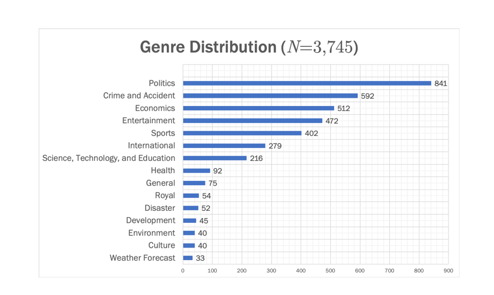

- How well would a simple rule-base perform on this task: 

  In my opinion, a simple rule-base could yield very good results because in each genre, there are some keywords that are clear enough to indicate which the genre is.

## Literature review

### Bag of Tricks for Efficient Text Classification 
- Ref: https://arxiv.org/pdf/1607.01759.pdf
- Detail of the proposed methodology:
	- Features: `n-grams`(bag of phrases)
	- Model: `logistic regression`
- guesstimating accuracy: `40`
- reason and reference:

	I guess that the accuracy would be around `40` because of many difficulties of my target task. The first one is that the language of the data, the data of the target task is `Thai` which has no space between words and has no clear sentence boundaries, but the data of this paper is `English`, which is easier to `tokenize`. The second one is that the number of training data, the more number of training data, the more probability to yield good result. As shown below, the number of data in `Yelp2013` is `335k` which is more than in `LST20` around `90` times. The third reason is the number of categories, the more number of categories, the less probability to yield good result. In `Yelp2013`, there are only `5` categories while in `LST20` there are up to `15` categories. The last reason is the imbalance in data. In `LST20` the imbalance of class distribution is obviously more than `Yelp2013`.
  
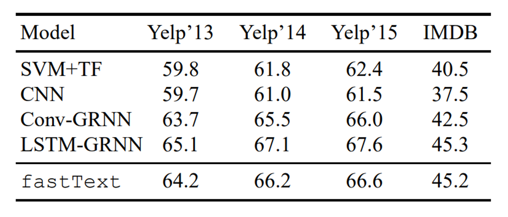

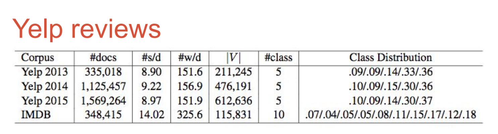

### Deep Unordered Composition Rivals Syntactic Methods for Text Classification
- Ref: https://www.aclweb.org/anthology/P15-1162.pdf

As this paper conduct many level experiments on different dataset, I will focus on only result on `IMDB movie review` dataset which is the only dataset that the author conduct the experiment on the `document-level`.

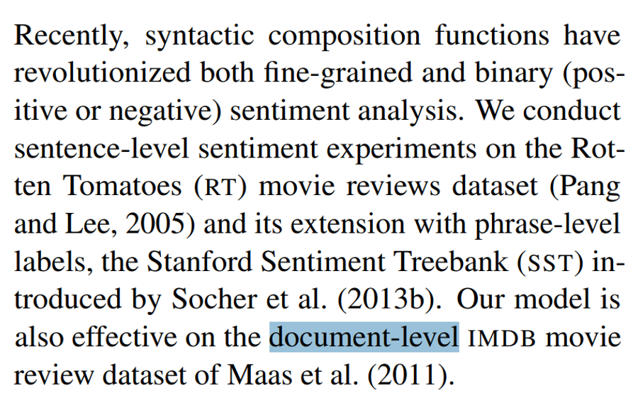

- Detail of the proposed methodology:
	- Features: `sentence embedding`
	- Model: `DAN`
- guesstimating accuracy: `65`
- reason and reference:

	I guess that the accuracy would be around `65` because of many difficulties of my target task. The first one is that the language of the data, the data of the target task is `Thai` which has no space between words and has no clear sentence boundaries, but the data of this paper is `English`, which is easier to `tokenize`. The second one is that the number of training data, the more number of training data, the more probability to yield good result. As shown below, the number of training data in `IMDB` is `25k` which is more than in `LST20` around `7` times. The third reason is the number of categories, the more number of categories, the less probability to yield good result. In `IMDB`, there are only `2` categories(binary task) while in `LST20` there are up to `15` categories. The last reason is the imbalance in data. In `LST20`, the class distribution is obviously imbalanced while in `IMDB`, the class distribution is balanced.

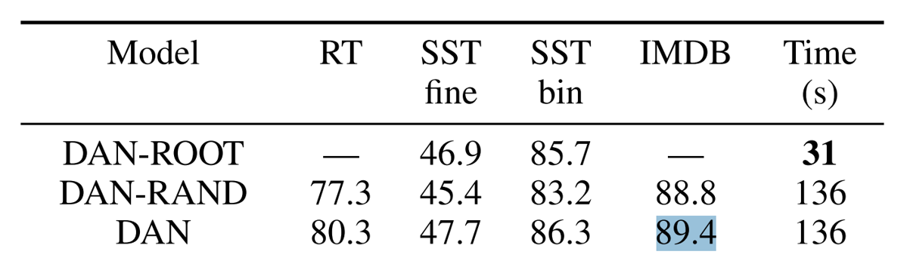

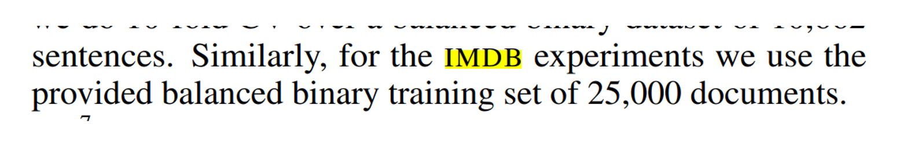

### Recurrent Convolutional Neural Networks for Text Classification
- Ref: https://ojs.aaai.org/index.php/AAAI/article/view/9513

  As this paper conduct experiments on many different dataset, I will focus on only result on `Stanford Sentiment Treebank (SST)` dataset which is one of the most well-known dataset for sentiment analysis
  
- Detail of the proposed methodology :
	- Features: `left context`, `word embedding` and `right context`
	- Model: `recurrent convolutional neural network`
- guesstimating accuracy: `30`
- reason and reference:

	I guess that the accuracy would be around `30` because of many difficulties of my target task. The first one is that the language of the data, the data of the target task is `Thai` which has no space between words and has no clear sentence boundaries, but the data of this paper is `English`, which is easier to `tokenize`. The second one is that the number of training data, the more number of training data, the more probability to yield good result. As shown below, the number of training dataset in `SST` is `8.5k` which is more than in `LST20` around `2` times. The third reason is the number of categories, the more number of categories, the less probability to yield good result. In `SST`, there are only `5` categories while in `LST20` there are up to `15` categories. The last reason is the imbalance in data. In `LST20` the imbalance of class distribution is obviously more than `SST`.

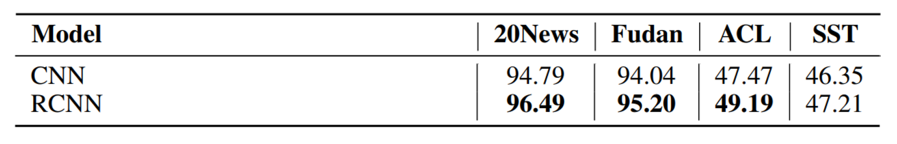

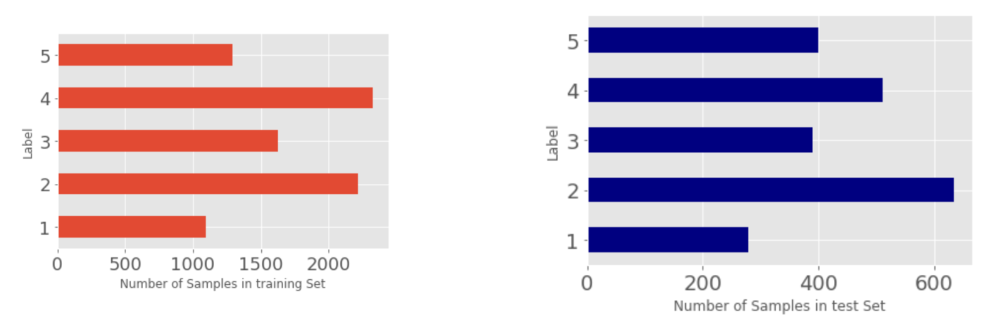

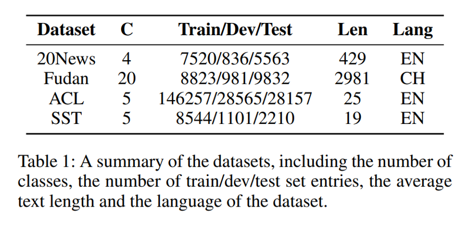

## Building models
I’ve not changed the given dataset, which are `3794` training dataset, `474` validation dataset and `483` test dataset.

### Multinomial Naive Bayes (Traditional)
- Segmentation: `newmm` and `attacut` word tokenize
- Inputs/Features: `word embedding` (bag of word)
- Model: `Logistic regression`
- Metric: `Accuracy`

|         | Test |
|:-------:|:-----:|
| newmm   | 0.801 |
| attacut | 0.718 |

- Runtime: `second`

|         | Training | Test |
|:-------:|:--------:|:----:|
| newmm   | 0.671 s | 0.0616 s |
| attacut | 1.314 s | 0.131 s |

### Deep Averaging Networks (Neuron-based)
- Network structure: 

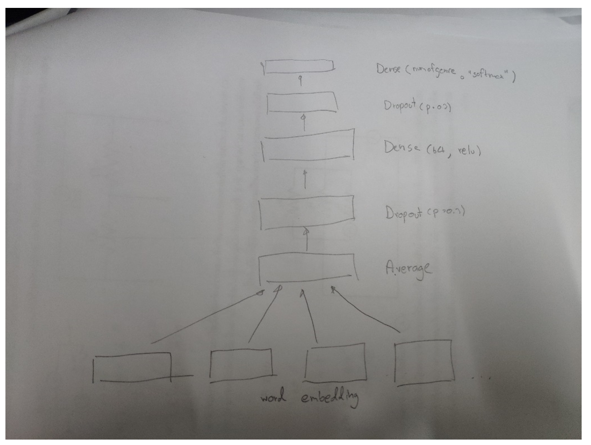

- Segmentation: `newmm` and `attacut` word tokenize
- Inputs/Features: `word embedding`
- Loss function: `categorical_crossentropy`
- Optimizer: `Adam` with `learning rate` = `0.001`
- Epoch: `30`
- Batch_size: `24`
- Metric: `Accuracy`

|         | Training | Validation | Test |
|:-------:|:--------:|:----------:|:----:|
| newmm   | 0.9996 | 0.8693 | 0.7528 |
| attacut | 0.9995 | 0.8522 | 0.7376 |

- Runtime: `ms/step`

|         | Training and Validation | Test |
|:-------:|:-----------------------:|:----:|
| newmm   | 18 ms/step | 3 ms/step |
| attacut | 33 ms/step | 4 ms/step |

  Due to the maximum amount of word in the article is `45,130` and lacking of large memory, when I trained the model with input = the list of embedding word which length of list = maximum amount of word in the article (padding with `0`), the session is crashed due to lack of memory. 
  
  So, I need to tokenize the document into the subdocument(each subdocument consists of  with `256` token, `64` overlapped). To illustrates, if there are `400` words in a document, I extract the `[0: 256]` word to a A subdocument, `[64: 320]` to a B subdocument, `[128:384]` to a C subdocument and the last `[192:]` to the D subdocument and use these subdocuments instead of the `400` words document.

### Simple 1D convnet (Neuron-based)
- Network structure: 

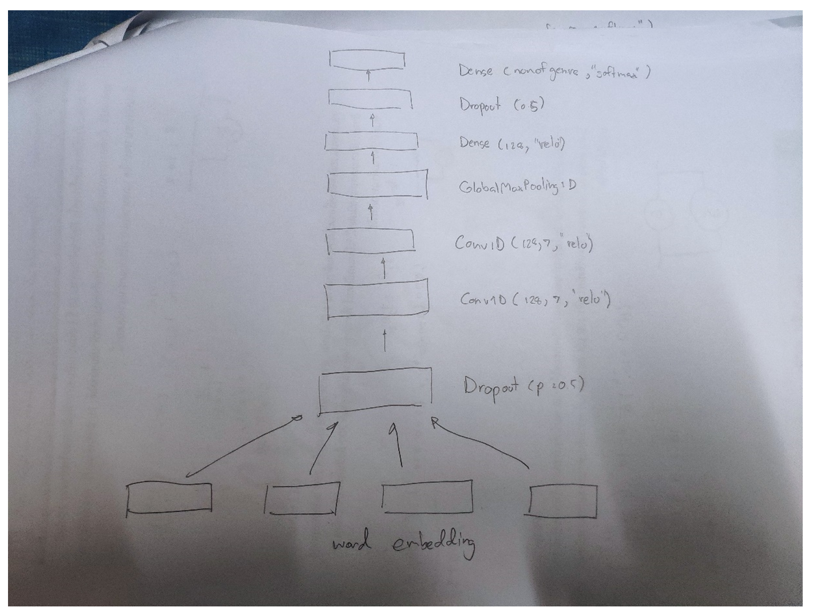

- Segmentation: `newmm` and `attacut` word tokenize
- Inputs/Features: `word embedding`
- Loss function: `categorical_crossentropy`
- Optimizer: `Adam` with `learning rate` = `0.001`
- Epoch: `30`
- Batch_size: `24`
- Metric: `Accuracy`

|         | Training | Validation | Test |
|:-------:|:--------:|:----------:|:----:|
| newmm   | 0.9909 | 0.7840 | 0.7182 |
| attacut | 0.9939 | 0.7524 | 0.6928 |

- Runtime: `ms/step`

|         | Training and Validation | Test |
|:-------:|:-----------------------:|:----:|
| newmm   | 18 ms/step | 4 ms/step |
| attacut | 34 ms/step | 5 ms/step |

  Due to the same problem, I also use subdocuments from the previous section instead of the document.
  
## Analysis

|         | Segmentation | Test Accuracy | Training Runtime (ms/step) | Test Runtime (ms/step) |
|:-------:|:------------:|:-------------:|:--------------------------:|:----------------------:|
| Multinomial Naive Bayes | newmm | 0.801 | 0.671 s | 0.0616 s |
| Multinomial Naive Bayes | attacut | 0.718 | 1.314 s | 0.131 s |
| DAN | newmm | 0.7528 | 18ms/step | 3ms/step |
| DAN | attacut | 0.7376 | 33ms/step | 4ms/step |
| Simple 1D convnet | newmm | 0.7182 | 18ms/step | 4ms/step |
| Simple 1D convnet | attacut | 0.6928 | 34ms/step | 5ms/step |

- Runtime
	- Between Model
	
  For training runtime, Multinomial Naive Bayes use the lowest runtime among 3 models. For test runtime, DAN use the lowest runtime among 3 models.
  
	- Between Segmentation
	
  The model using newmm as a word tokenizer yield less both training and test runtime.
  
- Accuracy
	- Between Model

  Multinomial Naive Bayes yield the highest accuracy among 3 models.
  
	- Between Segmentation

  The model using newmm as a word tokenizer yield better accuracy. 
 
- Common Error (are they expected) and Suggested possible solutions

The result yielded from the imbalance of the data is less than it should be as I’ve expected. => Reclassify the genre of data to be more balance (may ask the problem owner to do this).

- Real world application (which of three would you use)

I would use `Multinomial Naive Bayes` (with `newmm`) for search engine in service application because as it got the highest accuracy and it is a light weight model, so it could run in mobile phone and this type of application will interact with user, so we prefer the less test runtime to the more accuracy. Furthermore, For example, let’s say in shoppee, I would implement the help searcher feature that can classify which solution does the user need. To illustrate, user write a detail of his problem (the main problem is “how I can get coin back from the canceled order which the seller is the one who cancel the order”) with this feature, the application will classify which the problem is and navigate user to the solution page, so the user will not need to read the help menu and read all of the choice to get the answer, so it will provide a convenience to the user.
